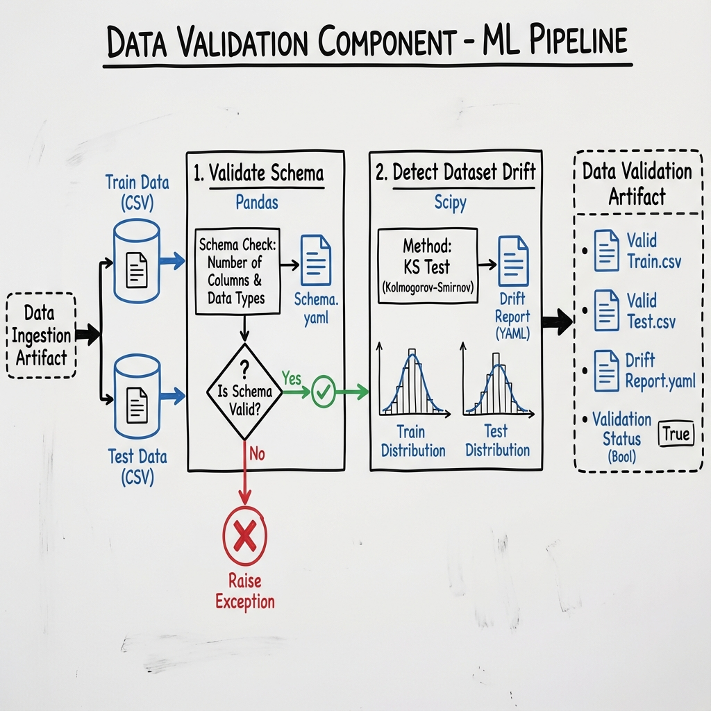
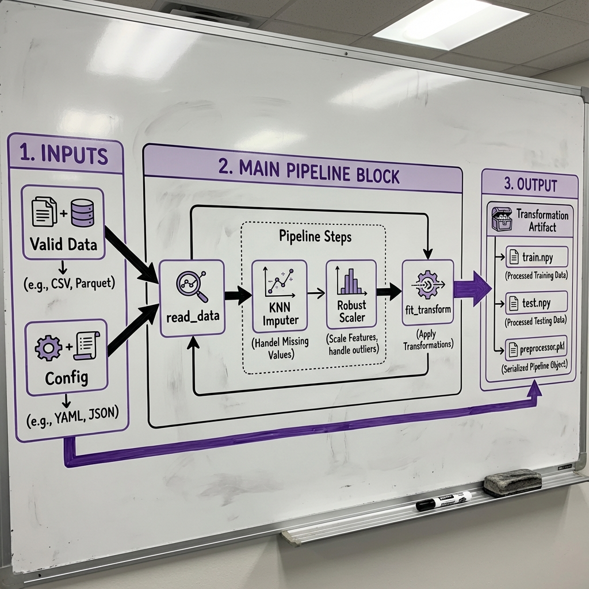
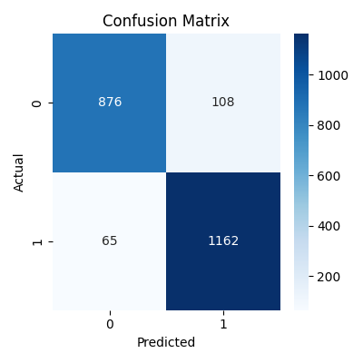
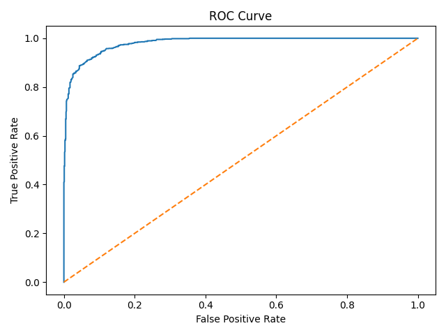

# 🛡️ Network Security System: Phishing URL Detection


## 📋 Table of Contents

- [About The Project](#-about-the-project)
- [Architecture](#-architecture)
- [Features](#-features)
- [Tech Stack](#-tech-stack)
- [Dataset](#-dataset)
- [Project Structure](#-project-structure)
- [Pipeline Workflow](#-pipeline-workflow)
- [Screenshots](#-screenshots)
- [Installation](#-installation)
- [Usage](#-usage)
- [Model Performance](#-model-performance)
- [Experiment Tracking](#-experiment-tracking)
- [Future Enhancements](#-future-enhancements)
- [Contributing](#-contributing)
- [License](#-license)
- [Contact](#-contact)

## 🚀 Live Demo

- **Live Application**: [inderjeet-networksecurity.hf.space](https://inderjeet-networksecurity.hf.space/)
- **Experiment Tracking**: [DagsHub Experiments](https://dagshub.com/Inder-26/NetworkSecurity/experiments#/)

## 🎯 About The Project

In the digital age, cybersecurity threats such as phishing attacks are becoming increasingly sophisticated. This project implements a robust **Network Security Machine Learning Pipeline** designed to detect phishing URLs with high accuracy.

It leverages a modular MLOps architecture, ensuring scalability, maintainability, and reproducibility. The system automates the entire flow from data ingestion to model deployment, utilizing advanced techniques like drift detection and automated model evaluation.

## 🏗️ Architecture

The system follows a strict modular pipeline architecture, orchestrated by a central training pipeline.


## ✨ Features

- **🚀 End-to-End Pipeline**: Fully automated workflow from data ingestion to model deployment.
- **🛡️ Data Validation**: Comprehensive schema checks and data drift detection using KS tests.
- **🔄 Robust Preprocessing**: Automated handling of missing values (KNN Imputer) and feature scaling (Robust Scaler).
- **🤖 Multi-Model Training**: Experiments with RandomForest, DecisionTree, GradientBoosting, and AdaBoost using GridSearchCV.
- **📊 Experiment Tracking**: Integrated with **MLflow** and **DagsHub** for tracking parameters, metrics, and models.
- **⚡ Fast API**: High-performance REST API built with **FastAPI** for real-time predictions.
- **🐳 Containerized**: Docker support for consistent deployment across environments.
- **☁️ Cloud Ready**: Designed to be deployed on platforms like AWS or Hugging Face Spaces.

## 🛠️ Tech Stack

- **Languages**: Python 3.8+
- **Frameworks**: FastAPI, Uvicorn
- **ML Libraries**: Scikit-learn, Pandas, NumPy
- **MLOps**: MLflow, DagsHub
- **Database**: MongoDB
- **Containerization**: Docker
- **Frontend**: HTML, CSS (Custom Design System), JavaScript

## 📊 Dataset

The project utilizes a dataset containing various URL features to distinguish between legitimate and phishing URLs.

- **Source**: [Phishing Dataset for Machine Learning](https://archive.ics.uci.edu/ml/datasets/Phishing+Websites) (or similar Phishing URL dataset)
- **Features**: IP Address, URL Length, TinyURL, forwarding, etc.
- **Target**: `Result` (LEGITIMATE / PHISHING)

## 📁 Project Structure

```
NetworkSecurity/
├── images/                  # Project diagrams and screenshots
├── networksecurity/         # Main package
│   ├── components/          # Pipeline components (Ingestion, Validation, Transformation, Training)
│   ├── pipeline/            # Training and Prediction pipelines
│   ├── entity/              # Artifact and Config entities
│   ├── constants/           # Project constants
│   ├── utils/               # Utility functions
│   └── exception/           # Custom exception handling
├── data_schema/             # Schema definitions
├── Dockerfile               # Docker configuration
├── app.py                   # FastAPI application entry point
├── requirements.txt         # Project dependencies
└── README.md                # Project documentation
```

## ⚙️ Pipeline Workflow

### 1. Data Ingestion 📥

Fetches data from MongoDB, handles fallback to local CSV, and performs train-test split.


### 2. Data Validation ✅

Validates data against schema and checks for data drift.


### 3. Data Transformation 🔄

Imputes missing values and scales features for optimal model performance.


### 4. Model Training 🤖

Trains and tunes multiple models, selecting the best one based on F1-score/Accuracy.


## 📸 Screenshots

### Prediction Results & Threat Assessment


### Experiment Tracking (DagsHub/MLflow)


## 💻 Installation

### Prerequisites

- Python 3.8+
- MongoDB Account
- DagsHub Account (for experiment tracking)

### Step-by-Step

1. **Clone the Repository**

   ```bash
   git clone https://github.com/Inder-26/NetworkSecurity.git
   cd NetworkSecurity
   ```

2. **Create Virtual Environment**

   ```bash
   python -m venv .venv
   source .venv/bin/activate  # On Windows: .venv\Scripts\activate
   ```

3. **Install Dependencies**

   ```bash
   pip install -r requirements.txt
   ```

4. **Set Environment Variables**
   Create a `.env` file with your credentials:
   ```env
   MONGO_DB_URL=your_mongodb_url_here
   MLFLOW_TRACKING_URI=https://dagshub.com/your_username/project.mlflow
   MLFLOW_TRACKING_USERNAME=your_username
   MLFLOW_TRACKING_PASSWORD=your_password
   ```

## 🚀 Usage

### Run the Web Application

```bash
python app.py
```

Visit `http://localhost:8000` to access the UI.

### Train a New Model

To trigger the training pipeline:

```bash
http://localhost:8000/train
```

Or use the "Train New Model" button in the UI.

## 📈 Model Performance

The system evaluates models using accuracy and F1 score.

- **Best Model**: [Automatically selected, typically RandomForest or GradientBoosting]
- **Recall**: Optimized to minimize false negatives (missing a phishing URL is dangerous).

### Model Evaluation Metrics

Below are the performance visualizations for the best trained model:

#### Confusion Matrix



#### ROC Curve



#### Precision-Recall Curve


## 🧪 Experiment Tracking

All runs are logged to DagsHub. You can view parameters, metrics, and models in the MLflow UI.

## 🚀 Future Enhancements

- [ ] Implement Deep Learning models (LSTM/CNN) for URL text analysis.
- [ ] Add real-time browser extension.
- [ ] Deploy serverless architecture.
- [ ] Add more comprehensive unit and integration tests.

## 🤝 Contributing

Contributions are welcome! Please fork the repository and create a pull request.

1. Fork the Project
2. Create your Feature Branch (`git checkout -b feature/AmazingFeature`)
3. Commit your Changes (`git commit -m 'Add some AmazingFeature'`)
4. Push to the Branch (`git push origin feature/AmazingFeature`)
5. Open a Pull Request

## 📄 License

Distributed under the MIT License. See `LICENSE` for more information.

## 📞 Contact

Inder - [GitHub Profile](https://github.com/Inder-26)
